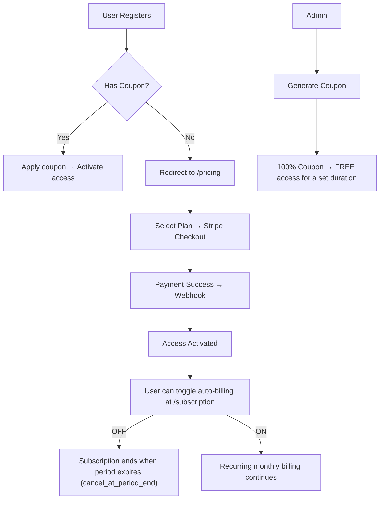

# 🧠 Vocabulary

> **A sentence-based vocabulary memorization web app.**
> Learn languages the right way — by memorizing full sentences, not isolated words.

---

## 📌 1. Vision & Mission

**Problem:** Most people struggle to learn English because they memorize **individual words** instead of **full sentences**.

**Solution:** A daily quiz web app where users translate 20 sentences per day from Malay (BM) into their target language (English, German, etc.). Similar to the Cake app concept, but focused on sentences rather than words.

---

## 📌 2. Tech Stack

| Layer    | Technology                      |
| -------- | ------------------------------- |
| Backend  | Laravel 12 (PHP 8.3+)           |
| Frontend | Next.js 15 (App Router)         |
| Styling  | Tailwind CSS + shadcn/ui        |
| Auth     | Laravel Sanctum (SPA Auth)      |
| Database | **PostgreSQL 16**               |
| Cache    | Redis                           |
| Payment  | Stripe (Recurring Subscription) |
| Queue    | Laravel Queue (Redis driver)    |

---

## 📌 3. Sitemap

```
/
├── /                              Landing Page (hero, register/login CTA)
├── /login                         Login
├── /register                      Register Account
├── /pricing                       Pricing & Subscription Page
├── /dashboard                     User Dashboard (progress, streak, level)
├── /quiz/[lang]/[levelId]         Quiz for a specific language & level
├── /results/[sessionId]           Results after completing 20 questions
├── /review/[lang]/[levelId]       Repeat quiz for unmemorized sentences
├── /profile                       Profile & Settings
├── /subscription                  Manage Subscription (toggle auto-billing, change plan)
│
└── /admin/                        ** ADMIN PANEL **
    ├── /admin/dashboard           Admin stats (users, revenue, active subscriptions)
    ├── /admin/languages           CRUD Languages
    ├── /admin/levels              CRUD Levels (per language)
    ├── /admin/sentences           CRUD Sentences (per level & language)
    ├── /admin/plans               Set subscription pricing (RM20 default, configurable)
    ├── /admin/coupons             Generate & manage discount coupons (100% = free)
    ├── /admin/users               User list & subscription status
    └── /admin/transactions        Stripe payment logs
```

---

## 📌 4. Database Schema (PostgreSQL)

### 4.1 `languages`

| Column                 | Type                 | Notes                                 |
| ---------------------- | -------------------- | ------------------------------------- |
| id                     | UUID                 | Primary Key                           |
| code                   | VARCHAR(10) UNIQUE   | e.g., `en`, `de`, `jp`               |
| name                   | VARCHAR(100)         | e.g., `English`, `German`, `Japanese` |
| flag                   | VARCHAR(10)          | Emoji flag                            |
| is_active              | BOOLEAN DEFAULT true |                                       |
| created_at, updated_at | TIMESTAMP            |                                       |

### 4.2 `levels`

| Column                 | Type                | Notes                            |
| ---------------------- | ------------------- | -------------------------------- |
| id                     | UUID                | Primary Key                      |
| language_id            | UUID FK → languages |                                  |
| order                  | INTEGER             | 1, 2, 3... (UNIQUE per language) |
| name                   | VARCHAR(100)        | e.g., `Beginner 1`               |
| created_at, updated_at | TIMESTAMP           |                                  |

### 4.3 `sentences`

| Column                 | Type                | Notes                                   |
| ---------------------- | ------------------- | --------------------------------------- |
| id                     | UUID                | Primary Key                             |
| level_id               | UUID FK → levels    |                                         |
| source_text            | TEXT                | Malay source sentence                   |
| target_text            | TEXT                | Target language sentence (EN/DE/JP)     |
| tags                   | TEXT[] DEFAULT '{}' | Array tags: `{"travel","daily","food"}` |
| difficulty             | SMALLINT DEFAULT 1  | 1=Easy, 2=Medium, 3=Hard                |
| order                  | INTEGER             | Order within level                      |
| created_at, updated_at | TIMESTAMP           |                                         |

### 4.4 `subscription_plans`

| Column                 | Type                 | Notes                   |
| ---------------------- | -------------------- | ----------------------- |
| id                     | UUID                 | Primary Key             |
| name                   | VARCHAR(100)         | e.g., `Monthly Premium` |
| slug                   | VARCHAR(50) UNIQUE   | e.g., `monthly-premium` |
| price_myr              | DECIMAL(10,2)        | e.g., 20.00             |
| stripe_price_id        | VARCHAR(255)         | Stripe Price ID         |
| is_active              | BOOLEAN DEFAULT true |                         |
| created_at, updated_at | TIMESTAMP            |                         |

### 4.5 `users`

| Column                 | Type                       | Notes               |
| ---------------------- | -------------------------- | ------------------- |
| id                     | UUID                       | Primary Key         |
| name                   | VARCHAR(255)               |                     |
| email                  | VARCHAR(255) UNIQUE        |                     |
| password               | VARCHAR(255)               | Bcrypt hashed       |
| role                   | VARCHAR(20) DEFAULT 'user' | `user` / `admin`    |
| stripe_id              | VARCHAR(255) NULLABLE      | Stripe Customer ID  |
| pm_type, pm_last_four  | VARCHAR(255) NULLABLE      | Payment method info |
| created_at, updated_at | TIMESTAMP                  |                     |

### 4.6 `subscriptions`

| Column                 | Type                         | Notes                                  |
| ---------------------- | ---------------------------- | -------------------------------------- |
| id                     | UUID                         | Primary Key                            |
| user_id                | UUID FK → users              |                                        |
| plan_id                | UUID FK → subscription_plans |                                        |
| stripe_subscription_id | VARCHAR(255)                 | Stripe Subscription ID                 |
| stripe_status          | VARCHAR(50)                  | `active`, `past_due`, `canceled`, etc. |
| auto_renew             | BOOLEAN DEFAULT true         | Toggled by user                        |
| ends_at                | TIMESTAMP NULLABLE           |                                        |
| trial_ends_at          | TIMESTAMP NULLABLE           |                                        |
| created_at, updated_at | TIMESTAMP                    |                                        |

### 4.7 `coupons`

| Column                 | Type                 | Notes                         |
| ---------------------- | -------------------- | ----------------------------- |
| id                     | UUID                 | Primary Key                   |
| code                   | VARCHAR(50) UNIQUE   | e.g., `FREE2026`              |
| description            | TEXT NULLABLE        |                               |
| discount_percent       | SMALLINT             | 0–100 (100 = free access)     |
| duration_days          | INTEGER              | Access duration (30/90/365)   |
| max_uses               | INTEGER NULLABLE     | NULL = unlimited              |
| current_uses           | INTEGER DEFAULT 0    |                               |
| is_active              | BOOLEAN DEFAULT true |                               |
| expires_at             | TIMESTAMP NULLABLE   |                               |
| created_at, updated_at | TIMESTAMP            |                               |

### 4.8 `coupon_redemptions`

| Column      | Type              | Notes       |
| ----------- | ----------------- | ----------- |
| id          | UUID              | Primary Key |
| user_id     | UUID FK → users   |             |
| coupon_id   | UUID FK → coupons |             |
| redeemed_at | TIMESTAMP         |             |

### 4.9 `quiz_sessions`

| Column                   | Type                              | Notes                                  |
| ------------------------ | --------------------------------- | -------------------------------------- |
| id                       | UUID                              | Primary Key                            |
| user_id                  | UUID FK → users                   |                                        |
| language_id              | UUID FK → languages               |                                        |
| level_id                 | UUID FK → levels                  |                                        |
| status                   | VARCHAR(20) DEFAULT 'in_progress' | `in_progress`, `completed`, `repeated` |
| total_questions          | SMALLINT DEFAULT 20               |                                        |
| correct_count            | SMALLINT DEFAULT 0                |                                        |
| started_at, completed_at | TIMESTAMP NULLABLE                |                                        |
| created_at, updated_at   | TIMESTAMP                         |                                        |

### 4.10 `quiz_answers`

| Column      | Type                    | Notes                       |
| ----------- | ----------------------- | --------------------------- |
| id          | UUID                    | Primary Key                 |
| session_id  | UUID FK → quiz_sessions |                             |
| sentence_id | UUID FK → sentences     |                             |
| user_answer | TEXT NULLABLE           |                             |
| is_correct  | BOOLEAN DEFAULT false   |                             |
| revealed    | BOOLEAN DEFAULT false   | User clicked "Show Answer"  |
| answered_at | TIMESTAMP               |                             |

### 4.11 `transactions`

| Column            | Type                             | Notes                        |
| ----------------- | -------------------------------- | ---------------------------- |
| id                | UUID                             | Primary Key                  |
| user_id           | UUID FK → users                  |                              |
| stripe_invoice_id | VARCHAR(255)                     |                              |
| subscription_id   | UUID FK → subscriptions NULLABLE |                              |
| amount            | DECIMAL(10,2)                    |                              |
| currency          | VARCHAR(3) DEFAULT 'myr'         |                              |
| status            | VARCHAR(50)                      | `paid`, `open`, `void`, etc. |
| paid_at           | TIMESTAMP NULLABLE               |                              |
| created_at        | TIMESTAMP                        |                              |

### PostgreSQL Extensions

```sql
CREATE EXTENSION IF NOT EXISTS "uuid-ossp";
CREATE EXTENSION IF NOT EXISTS "citext";
```

---

## 📌 5. Quiz Core Loop

```mermaid
flowchart TD
    A[Start Quiz Level N] --> B[Display Malay Sentence]
    B --> C{User types answer}
    C -->|"Correct ✓"| D[Mark as correct]
    C -->|"Wrong / Don't Know"| E[Click "Show Answer"]
    E --> F[Display correct answer & compare]
    F --> G[Mark as revealed + incorrect]
    D --> H{All 20 questions done?}
    G --> H
    H -->|No| B
    H -->|Yes| I[Display Result - Score /20]
    I --> J{Choose action}
    J -->|"Not Memorized"| K[Repeat same level quiz]
    J -->|"Memorized"| L[Unlock Level N+1]
    K --> A
    L --> M[Redirect to Dashboard]
```

---

## 📌 6. Subscription & Coupon Flow



---

## 📌 7. Stripe Integration Plan

| Component               | Description                                                                                                                                                    |
| ----------------------- | -------------------------------------------------------------------------------------------------------------------------------------------------------------- |
| **Stripe Checkout**     | User selects plan → redirect to Stripe Checkout Session                                                                                                        |
| **Webhook Handler**     | Laravel Route: `POST /stripe/webhook` — handles: `checkout.session.completed`, `invoice.paid`, `customer.subscription.updated`, `customer.subscription.deleted` |
| **Auto-billing Toggle** | User toggles at `/subscription` → Laravel calls `$stripe->subscriptions->update(id, ['cancel_at_period_end' => true/false])`                                   |
| **Free Coupon**         | Admin generates 100% coupon → user redeems → skips payment, activates a dummy subscription with `ends_at = now() + duration_days`                              |

---

## 📌 8. Middleware & Authorization (Laravel Gates)

| Gate / Middleware | Function                                             |
| ----------------- | ---------------------------------------------------- |
| `auth`            | Must be logged in                                    |
| `auth:sanctum`    | API auth for Next.js SPA                             |
| `subscribed`      | Has active subscription OR active coupon redemption  |
| `admin`           | Role = `admin`                                       |
| `can-quiz`        | `subscribed` + level unlocked + language accessible  |

---

## 📌 9. Backend Folder Structure (Modular Monolith)

```
backend/
├── app/
│   ├── Models/
│   │   ├── User.php
│   │   ├── Language.php
│   │   ├── Level.php
│   │   ├── Sentence.php
│   │   ├── SubscriptionPlan.php
│   │   ├── Subscription.php
│   │   ├── Coupon.php
│   │   ├── CouponRedemption.php
│   │   ├── QuizSession.php
│   │   ├── QuizAnswer.php
│   │   └── Transaction.php
│   ├── Http/
│   │   ├── Controllers/
│   │   │   ├── Api/
│   │   │   │   ├── AuthController.php
│   │   │   │   ├── QuizController.php
│   │   │   │   ├── LanguageController.php
│   │   │   │   ├── SubscriptionController.php
│   │   │   │   ├── CouponController.php
│   │   │   │   └── ProfileController.php
│   │   │   └── Admin/
│   │   │       ├── DashboardController.php
│   │   │       ├── LanguageController.php
│   │   │       ├── LevelController.php
│   │   │       ├── SentenceController.php
│   │   │       ├── PlanController.php
│   │   │       ├── CouponController.php
│   │   │       ├── UserController.php
│   │   │       └── TransactionController.php
│   │   ├── Middleware/
│   │   │   ├── AdminMiddleware.php
│   │   │   └── SubscribedMiddleware.php
│   │   └── Resources/
│   │       └── (API Resources)
│   ├── Services/
│   │   ├── StripeService.php
│   │   ├── QuizService.php
│   │   └── CouponService.php
│   └── Enums/
│       ├── UserRole.php
│       ├── QuizSessionStatus.php
│       └── SubscriptionStatus.php
├── database/
│   └── migrations/
└── routes/
    ├── api.php
    └── web.php
```

---

## 📌 10. Frontend Folder Structure (Next.js App Router)

```
frontend/
├── app/
│   ├── layout.tsx
│   ├── page.tsx                    # Landing
│   ├── login/page.tsx
│   ├── register/page.tsx
│   ├── pricing/page.tsx
│   ├── dashboard/page.tsx
│   ├── quiz/[lang]/[levelId]/page.tsx
│   ├── results/[sessionId]/page.tsx
│   ├── review/[lang]/[levelId]/page.tsx
│   ├── profile/page.tsx
│   ├── subscription/page.tsx
│   └── admin/
│       ├── layout.tsx
│       ├── dashboard/page.tsx
│       ├── languages/page.tsx
│       ├── levels/page.tsx
│       ├── sentences/page.tsx
│       ├── plans/page.tsx
│       ├── coupons/page.tsx
│       ├── users/page.tsx
│       └── transactions/page.tsx
├── components/
│   ├── ui/                         # shadcn/ui components
│   ├── quiz/
│   │   ├── QuizCard.tsx
│   │   ├── AnswerInput.tsx
│   │   ├── RevealAnswer.tsx
│   │   └── QuizProgress.tsx
│   ├── layout/
│   │   ├── Navbar.tsx
│   │   ├── Sidebar.tsx
│   │   └── Footer.tsx
│   └── admin/
│       ├── AdminSidebar.tsx
│       └── DataTable.tsx
├── lib/
│   ├── api.ts                      # Axios instance
│   ├── auth.ts                     # Auth helpers
│   └── utils.ts
├── hooks/
│   ├── useQuiz.ts
│   ├── useAuth.ts
│   └── useSubscription.ts
└── types/
    └── index.ts
```

---

## 📌 11. Communication Language

| Context                                                  | Language                |
| -------------------------------------------------------- | ----------------------- |
| Conversations, planning, roadmap                         | **Bahasa Malaysia (BM)** |
| Source code, code comments, API docs, SQL, commit messages | **English (EN)**       |

---

## 📌 12. Principles & Rules

### Architecture

1. Monorepo structure — `backend/` + `frontend/` in one repository
2. Decoupled Client-Server — REST JSON API
3. Modular Monolith — each domain in its own folder
4. Strict Isolation — do not modify files outside of scope unless instructed
5. Respect existing architecture

### Security (Summary)

1. Strict Input Validation (server-side)
2. Universal Sanitization (XSS prevention)
3. Prepared Statements only (Eloquent ORM)
4. Business Logic Integrity
5. Object-Level Access Control — always filter by `user_id`
6. UUID v4 for all Primary Keys
7. Fail-Safe Error Handling — never expose stack traces
8. Deny by Default
9. Atomic Transactions
10. Bcrypt for passwords
11. Laravel Middleware for CSRF + Auth
12. Modular Code (<250 lines per file)
13. Rate Limiting
14. Security Headers
15. Security Event Logging
16. Environment Variable Protection — no hardcoded secrets
17. Dependency Scanning

### Development Protocol

- After completing each feature → update `roadmap.md` & `features.md`
- Clean up debug logs after debugging is complete
- Auto-restart backend/frontend on every code change
- Unit Tests are mandatory for every new feature

---

## 📌 13. API Routes Plan

### Public

```
POST   /api/register
POST   /api/login
POST   /api/logout
GET    /api/languages
GET    /api/plans
POST   /api/coupons/validate          # Validate coupon code
```

### Authenticated (auth:sanctum)

```
GET    /api/user
PUT    /api/user/profile
GET    /api/dashboard
GET    /api/levels?language_id=
POST   /api/quiz/start                # Start quiz session
POST   /api/quiz/{sessionId}/answer   # Submit answer
GET    /api/quiz/{sessionId}          # Get session details
POST   /api/quiz/{sessionId}/complete # Complete session
GET    /api/results/{sessionId}
GET    /api/review/{languageId}/{levelId}  # Get unmemorized sentences
POST   /api/subscription/create-checkout
POST   /api/subscription/toggle-renew
GET    /api/subscription/status
POST   /api/coupons/redeem
GET    /api/coupons/my-coupons
```

### Admin (auth:sanctum + admin)

```
GET    /api/admin/dashboard
GET    /api/admin/users
PUT    /api/admin/users/{id}
CRUD   /api/admin/languages
CRUD   /api/admin/languages/{langId}/levels
CRUD   /api/admin/languages/{langId}/levels/{levelId}/sentences
CRUD   /api/admin/plans
CRUD   /api/admin/coupons
POST   /api/admin/coupons/{id}/generate   # Generate new coupon
GET    /api/admin/transactions
```

---

## 📌 14. UI/UX Notes

- Mobile-first responsive design
- Dark mode by default (easier on the eyes for night study sessions)
- Clean quiz UI — sentence displayed large in the center, input at the bottom, progress bar at the top
- "Show Answer" button clearly visible — amber/warning color
- Score animation after completing 20 questions
- Confetti effect when unlocking a new level
- Streak counter on dashboard (motivation booster)

---

## 📌 15. MVP Scope (Phase 1)

1. ✅ Auth (Register/Login/Logout)
2. ✅ Admin CRUD: Languages, Levels, Sentences
3. ✅ Admin: Subscription Plans (set pricing)
4. ✅ Admin: Coupon generation (100% free)
5. ✅ Stripe Checkout + Webhook
6. ✅ User Dashboard
7. ✅ Quiz core loop (20 sentences, answer + reveal)
8. ✅ "Not Memorized" / "Memorized" flow
9. ✅ Subscription management (toggle auto-billing)
10. ✅ Coupon redemption

---

## 📌 16. Changelog

| Date       | Change                                                      |
| ---------- | ----------------------------------------------------------- |
| 2026-05-23 | Initial document — sitemap, schema, flow, tech stack        |
| 2026-05-23 | PostgreSQL chosen over MySQL                                |
| 2026-05-23 | Admin panel + Stripe + Coupon system added                  |
| 2026-06-06 | Renamed `laravel/` directory to `backend/`                  |

---

> **EOF**
> This file is the source of truth for the Vocabulary project.
> Always read this file before starting any development work.
