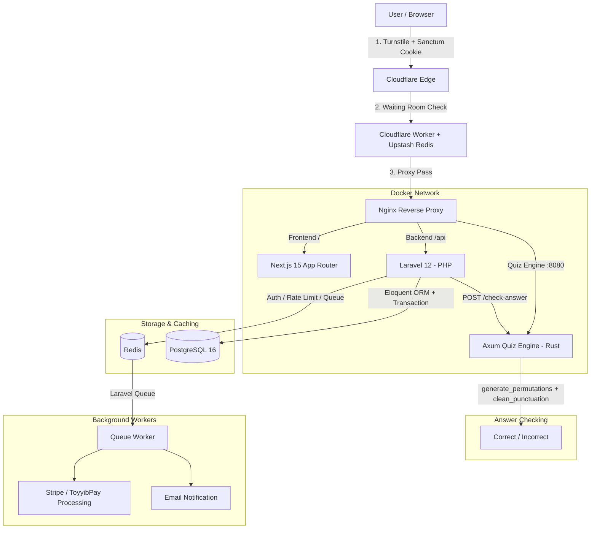
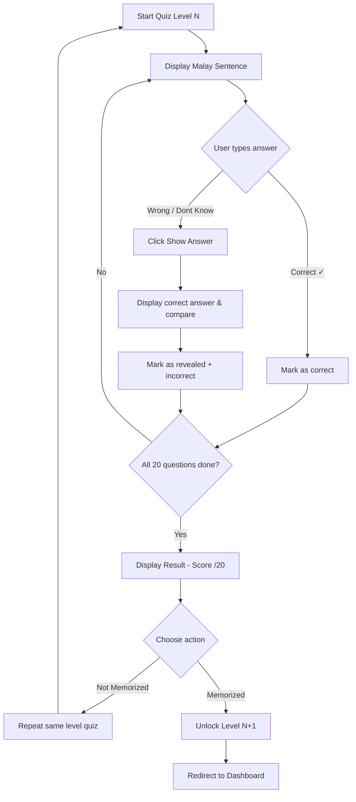
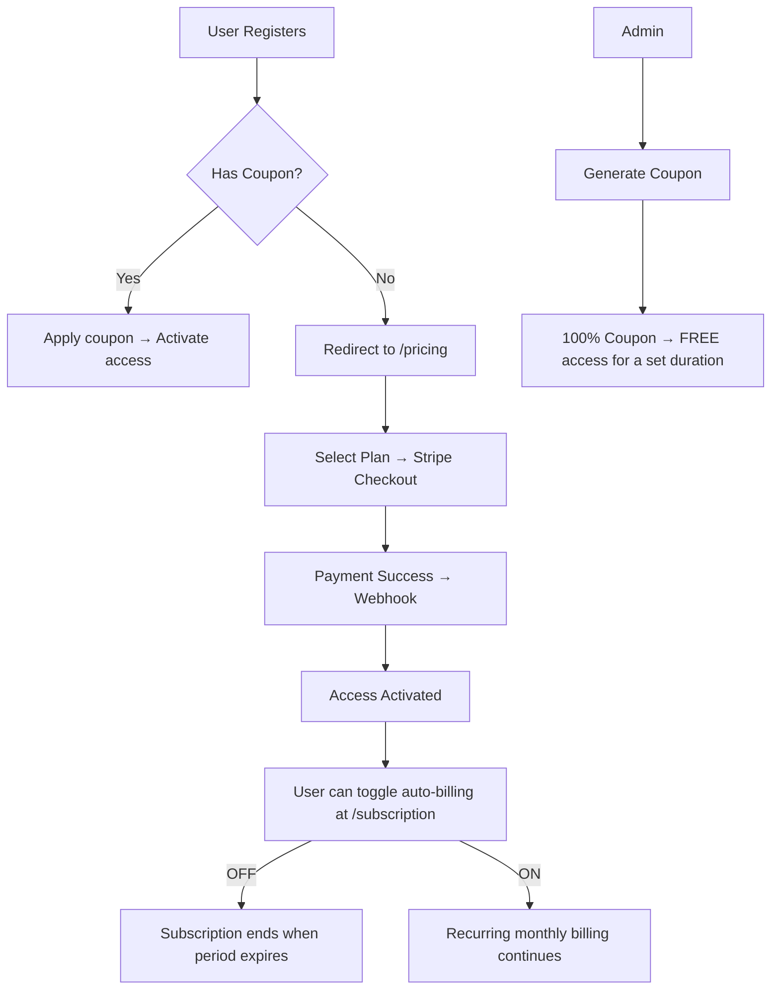

# 📋 Vocabulary

_The primary Source of Truth for the entire project lifecycle. Structured according to Abu Hanifah Phase 1 standards._

---

## 1. Vision & Mission

**Vision**: To become the leading language learning platform in Malaysia that focuses on memorizing **full sentences**, not just individual words.

**Mission**: To help users master their target language through daily practice — translating 20 sentences from Malay (BM) into their target language — making them fluent and confident speakers.

**Unique Selling Points (USP)**:
- "Memorize Sentences, Not Words" — a unique approach compared to existing apps.
- Daily interactive quizzes with a high-speed Rust-powered answer checker.
- Support for colloquial answer variations (`wanna`, `gonna`, `gotta`) so users learn real-world language.
- Flexible coupon & subscription system (free / paid).

---

## 2. Tech Stack

| Component | Technology | Notes |
| :--- | :--- | :--- |
| **Frontend** | Next.js 15 (App Router), TypeScript, Tailwind CSS + shadcn/ui | Server Components + Client Components hybrid |
| **Backend** | Laravel 12 (PHP 8.3+) | Sanctum SPA Auth, Modular Controllers, Services |
| **Quiz Engine** | Rust (Axum) | High-speed answer-checking microservice (Docker container) |
| **Database** | PostgreSQL 16 | UUID v4 as Primary Keys, citext extension |
| **Cache & Queue** | Redis | Rate Limiting, Laravel Queue driver, session cache |
| **Payment** | Stripe API & ToyyibPay | Webhook handler for checkout, invoice, subscription events & FPX |
| **Waiting Room** | Cloudflare Worker + Upstash Redis | Count active visitors using Sliding Window (ZSET) |
| **Security** | Cloudflare Turnstile, Bcrypt Hashing, Laravel CSRF | Sanctum SPA cookies for auth |
| **Infrastructure** | Docker Compose, Nginx (Reverse Proxy) | PostgreSQL, Redis, Quiz Engine, Mailpit (dev) |
| **CI/CD** | GitHub Actions → GHCR | Auto deploy with Docker Compose pull |

---

## 3. Sitemap & Page Flow

### Layer A: Public Pages
| Route | Function |
| :--- | :--- |
| `/` | Landing page (hero, register/login CTA) |
| `/login` | User login |
| `/register` | New account registration |
| `/pricing` | Pricing & subscription plans |
| `/promo` | Marketing promotion page (Stitch UI) |

### Layer B: User Pages (Registered Users)
| Route | Function |
| :--- | :--- |
| `/dashboard` | Progress summary, streak, latest level |
| `/quiz/[lang]/[levelId]` | 20-sentence memorization quiz for a specific language & level |
| `/results/[sessionId]` | Score results after completing 20 questions |
| `/review/[lang]/[levelId]` | Repeat quiz for unmemorized sentences |
| `/profile` | User profile & settings |
| `/subscription` | Manage subscription (toggle auto-billing, change plan) |

### Layer C: Admin Pages (Admin Role)
| Route | Function |
| :--- | :--- |
| `/admin/dashboard` | Admin statistics (total users, revenue, active subscriptions) |
| `/admin/languages` | CRUD Languages |
| `/admin/levels` | CRUD Levels (per language) |
| `/admin/sentences` | CRUD Sentences (per level & language) + `[formal/colloquial]` format support |
| `/admin/plans` | Set subscription pricing (configurable) |
| `/admin/coupons` | Generate & manage discount coupons (100% = free access) |
| `/admin/users` | User list & subscription status |
| `/admin/transactions` | Stripe payment logs |

---

## 4. Database Schema (PostgreSQL)

Summary of core tables based on existing Laravel migrations:

| Table | Purpose | Key Indexes |
| :--- | :--- | :--- |
| `users` | System users (User & Admin) | `email` (UNIQUE), `role` |
| `languages` | Supported languages (EN, DE, JP) | `code` (UNIQUE) |
| `levels` | Difficulty tiers per language | `language_id`, `order` (UNIQUE per language) |
| `sentences` | Quiz question sentences (BM → Target) | `level_id`, `order` |
| `subscription_plans` | Subscription plans (price, Stripe Price ID) | `slug` (UNIQUE) |
| `subscriptions` | Active user subscriptions | `user_id`, `stripe_subscription_id` |
| `coupons` | Discount coupons (0–100%) | `code` (UNIQUE) |
| `coupon_redemptions` | Coupon redemption logs per user | `user_id`, `coupon_id` |
| `quiz_sessions` | User quiz sessions (20 questions each) | `user_id`, `level_id`, `status` |
| `quiz_answers` | Individual answers within a quiz session | `session_id`, `sentence_id` |
| `transactions` | Stripe payment transaction logs | `user_id`, `status` |

---

## 5. System Architecture (Core Loop)



### 5.1 Quiz Flow



### 5.2 Subscription & Coupon Flow



---

## 6. API & Third-Party Integrations

| Service | Purpose | Backend Endpoint |
| :--- | :--- | :--- |
| **Stripe & ToyyibPay** | Automatic subscription payments & FPX (Checkout + Webhook) | `POST /stripe/webhook`, `POST /toyyibpay/webhook` |
| **Upstash Redis** | Manage Waiting Room session (Sliding Window ZSET) | Handled at Cloudflare Edge |
| **Cloudflare Turnstile** | Bot verification on Login, Register, Promo forms | `verify_turnstile()` middleware |
| **Quiz Engine (Rust)** | High-speed answer checker + `[formal/colloquial]` variation support | `POST :8080/check-answer` |
| **SMTP (Mailpit dev)** | Email delivery (verification, notifications) | Laravel Queue |

---

## 7. Security Protocol (32 Global Rules)

This project adheres to all 32 Global Security Rules (`RULE[user_global]`). Key implementations:

- [x] **Input Validation**: Server-side validation on all Laravel endpoints.
- [x] **Sanitization**: HTML escaping for all data rendered in UI.
- [x] **Prepared Statements**: Eloquent ORM parameterized queries only.
- [x] **OLAC**: Every query includes `WHERE id = ? AND user_id = ?`.
- [x] **UUID v4**: All resources use UUID, not integer IDs.
- [x] **Bcrypt Hashing**: Passwords hashed using Bcrypt.
- [x] **Sanctum SPA Auth**: Cookie-based auth (SameSite=Lax, HttpOnly).
- [x] **CSRF Protection**: Laravel CSRF token on every POST/PUT/DELETE.
- [x] **Rate Limiting**: Global + strict on auth endpoints.
- [x] **Cloudflare Turnstile**: Login, Register, Promo forms (UI & API `verify_turnstile`).
- [x] **Waiting Room Strategy**: Sliding Window (ZSET) Upstash & Admin Secret Bypass.
- [x] **Atomic Transactions**: `DB::transaction` for multi-table operations.
- [x] **Modular Code**: Files < 250 lines, SRP, Service classes.
- [x] **Security Event Logging**: Important activities logged to database.
- [x] **Environment Variable Protection**: No hardcoded secrets.

---

## 8. Project Folder Structure (Modular)

```
vocabulary/
├── backend/                         # Laravel 12 Backend
│   ├── app/
│   │   ├── Models/                  # Eloquent Models (User, Language, Level, etc.)
│   │   ├── Http/
│   │   │   ├── Controllers/
│   │   │   │   ├── Api/             # Public & User endpoints
│   │   │   │   │   ├── AuthController.php
│   │   │   │   │   ├── QuizController.php
│   │   │   │   │   ├── LanguageController.php
│   │   │   │   │   ├── SubscriptionController.php
│   │   │   │   │   ├── CouponController.php
│   │   │   │   │   └── ProfileController.php
│   │   │   │   └── Admin/           # Admin-specific handlers
│   │   │   │       ├── DashboardController.php
│   │   │   │       ├── LanguageController.php
│   │   │   │       ├── LevelController.php
│   │   │   │       ├── SentenceController.php
│   │   │   │       ├── PlanController.php
│   │   │   │       ├── CouponController.php
│   │   │   │       ├── UserController.php
│   │   │   │       └── TransactionController.php
│   │   │   └── Middleware/          # AdminMiddleware, SubscribedMiddleware
│   │   ├── Services/                # StripeService, QuizService, CouponService
│   │   └── Enums/                   # UserRole, QuizSessionStatus
│   ├── database/migrations/         # Laravel migration files
│   └── routes/                      # api.php, web.php
├── frontend/                        # Next.js 15 Frontend
│   └── src/
│       ├── app/
│       │   ├── page.tsx             # Landing page
│       │   ├── login/               # Login
│       │   ├── register/            # Registration
│       │   ├── pricing/             # Pricing page
│       │   ├── promo/               # Marketing promo page (Stitch UI)
│       │   ├── dashboard/           # User dashboard
│       │   ├── quiz/[lang]/[levelId]/ # Memorization quiz
│       │   ├── review/[lang]/[levelId]/ # Review quiz
│       │   ├── profile/             # User profile
│       │   ├── subscription/        # Manage subscription
│       │   └── admin/               # Admin portal
│       │       ├── dashboard/
│       │       ├── languages/
│       │       ├── levels/
│       │       ├── sentences/
│       │       ├── plans/
│       │       ├── coupons/
│       │       ├── users/
│       │       └── transactions/
│       ├── components/ui/           # shadcn/ui components
│       └── lib/                     # api.ts, auth.ts, utils.ts
├── quiz-engine/                     # Rust Axum Microservice
│   └── src/main.rs                  # check-answer endpoint + [formal/colloquial] parser
├── nginx/                           # Nginx reverse proxy config
├── scripts/                         # Utility scripts
├── docker-compose.yml               # Development environment
├── docker-compose.prod.yml          # Production deployment
├── .github/                         # CI/CD workflows
├── roadmap.md                       # Feature status & test tracking
├── features.md                      # Master feature list & unit test status
├── security_audit.md                # Security audit pass records per module
└── prompt_planning.md               # Source of Truth (Malay version)
```

---

## 9. UI/UX Guidelines

- **Design System**: Light mode primary, amber/yellow as the main accent color.
- **Primary Colors**: Amber (`#f59e0b`), Orange (`#f97316`), Green success (`#22c55e`).
- **Typography**: Modern system fonts (Inter via Tailwind defaults).
- **Components**: shadcn/ui components, rounded corners, subtle borders.
- **Animations**: Hover effects, transition-colors, confetti on level unlock.
- **Responsive**: Mobile-first with grid breakpoints (`md:`, `lg:`).
- **Icons**: Lucide React icon library.
- **Quiz UI**: Large sentence in center, input at bottom, progress bar on top, "Show Answer" button in amber/warning color.
- **Key Feature**: Colloquial answer variations `[want to/wanna]` displayed as `want to (wanna)` to users.

---

## 10. Roadmap MVP

This project has passed the MVP phase and is now in active maintenance mode. Current status:

| Category | Status |
| :--- | :--- |
| Infrastructure (Docker, Nginx, Redis, Quiz Engine) | ✅ Complete |
| Database (Migrations, Indexing, Transactions) | ✅ Complete |
| Security Module (Auth, Turnstile, Rate Limiting) | ✅ Complete |
| Admin CRUD (Languages, Levels, Sentences, Plans, Coupons) | ✅ Complete |
| Quiz Core Loop (20 sentences, answer + reveal + practice) | ✅ Complete |
| Answer Variations `[formal/colloquial]` (Quiz Engine + Frontend) | ✅ Complete |
| Stripe Checkout + Webhook | ✅ Complete |
| Coupon System (100% free access) | ✅ Complete |
| Subscription Management (toggle auto-billing) | ✅ Complete |
| User Dashboard (progress, streak) | ✅ Complete |
| Promo Page (Stitch UI, responsive) | ✅ Complete |
| CI/CD Pipeline (GitHub Actions → GHCR) | ✅ Complete |

---

_Last updated: 17 June 2026_
_Maintained by: Abu Hanifah (AI Senior Engineer)_
