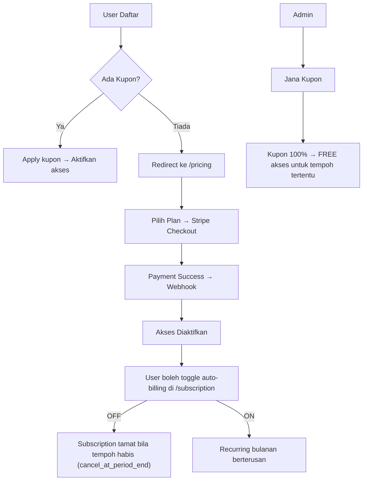

D# 🧠 Vocabulary — Prompt Planning Utama

> **System Prompt Utama Projek Vocabulary**
> Semua perancangan, struktur, peraturan, dan konteks projek dirujuk dari fail ini.
> Setiap kali development disambung, baca fail ini dulu.

---

## 📌 1. Visi & Misi

**Masalah**: Ramai orang susah belajar English kerana hafal **perkataan**, bukan **ayat**.

**Penyelesaian**: Web app quiz hafalan 20 ayat setiap hari. User translate ayat BM ke bahasa sasaran (English, German, dll). Sama seperti konsep Cake app, tapi fokus pada ayat, bukan perkataan.

---

## 📌 2. Tech Stack

| Layer    | Teknologi                       |
| -------- | ------------------------------- |
| Backend  | Laravel 12 (PHP 8.3+)           |
| Frontend | Next.js 15 (App Router)         |
| Styling  | Tailwind CSS + shadcn/ui        |
| Auth     | Laravel Sanctum (SPA Auth)      |
| Database | **PostgreSQL 16**               |
| Cache    | Redis                           |
| Payment  | Stripe (Recurring Subscription) |
| Queue    | Laravel Queue (Redis driver)    |

---

## 📌 3. Sitemap Lengkap

```
/
├── /                              Landing Page (hero, CTA daftar/masuk)
├── /login                         Login
├── /register                      Daftar Akaun
├── /pricing                       Halaman Harga & Langganan
├── /dashboard                     Dashboard Pengguna (progress, streak, level)
├── /quiz/[lang]/[levelId]         Quiz untuk bahasa & level tertentu
├── /results/[sessionId]           Keputusan selepas selesai 20 soalan
├── /review/[lang]/[levelId]       Ulang quiz untuk ayat belum hafal
├── /profile                       Profil & Tetapan
├── /subscription                  Urus Langganan (toggle auto-billing, tukar plan)
│
└── /admin/                        ** PANEL ADMIN **
    ├── /admin/dashboard           Statistik admin (user, revenue, active subs)
    ├── /admin/languages           CRUD Bahasa
    ├── /admin/levels              CRUD Level (ikut bahasa)
    ├── /admin/sentences           CRUD Ayat (ikut level & bahasa)
    ├── /admin/plans               Set harga langganan (RM20 default, boleh ubah)
    ├── /admin/coupons             Jana & urus kupon diskaun (100% = free)
    ├── /admin/users               Senarai pengguna & status langganan
    └── /admin/transactions        Log pembayaran Stripe
```

---

## 📌 4. Database Schema (PostgreSQL)

### 4.1 `languages`

| Column                 | Type                 | Notes                                 |
| ---------------------- | -------------------- | ------------------------------------- |
| id                     | UUID                 | Primary Key                           |
| code                   | VARCHAR(10) UNIQUE   | e.g., `en`, `de`, `jp`                |
| name                   | VARCHAR(100)         | e.g., `English`, `German`, `Japanese` |
| flag                   | VARCHAR(10)          | Emoji flag                            |
| is_active              | BOOLEAN DEFAULT true |                                       |
| created_at, updated_at | TIMESTAMP            |                                       |

### 4.2 `levels`

| Column                 | Type                | Notes                            |
| ---------------------- | ------------------- | -------------------------------- |
| id                     | UUID                | Primary Key                      |
| language_id            | UUID FK → languages |                                  |
| order                  | INTEGER             | 1, 2, 3... (UNIQUE per language) |
| name                   | VARCHAR(100)        | e.g., `Beginner 1`               |
| created_at, updated_at | TIMESTAMP           |                                  |

### 4.3 `sentences`

| Column                 | Type                | Notes                                   |
| ---------------------- | ------------------- | --------------------------------------- |
| id                     | UUID                | Primary Key                             |
| level_id               | UUID FK → levels    |                                         |
| source_text            | TEXT                | Ayat BM (source language)               |
| target_text            | TEXT                | Ayat bahasa sasaran (EN/DE/JP)          |
| tags                   | TEXT[] DEFAULT '{}' | Array tags: `{"travel","daily","food"}` |
| difficulty             | SMALLINT DEFAULT 1  | 1=Mudah, 2=Sederhana, 3=Sukar           |
| order                  | INTEGER             | Susunan dalam level                     |
| created_at, updated_at | TIMESTAMP           |                                         |

### 4.4 `subscription_plans`

| Column                 | Type                 | Notes                   |
| ---------------------- | -------------------- | ----------------------- |
| id                     | UUID                 | Primary Key             |
| name                   | VARCHAR(100)         | e.g., `Monthly Premium` |
| slug                   | VARCHAR(50) UNIQUE   | e.g., `monthly-premium` |
| price_myr              | DECIMAL(10,2)        | e.g., 20.00             |
| stripe_price_id        | VARCHAR(255)         | Stripe Price ID         |
| is_active              | BOOLEAN DEFAULT true |                         |
| created_at, updated_at | TIMESTAMP            |                         |

### 4.5 `users`

| Column                 | Type                       | Notes               |
| ---------------------- | -------------------------- | ------------------- |
| id                     | UUID                       | Primary Key         |
| name                   | VARCHAR(255)               |                     |
| email                  | VARCHAR(255) UNIQUE        |                     |
| password               | VARCHAR(255)               | Bcrypt hashed       |
| role                   | VARCHAR(20) DEFAULT 'user' | `user` / `admin`    |
| stripe_id              | VARCHAR(255) NULLABLE      | Stripe Customer ID  |
| pm_type, pm_last_four  | VARCHAR(255) NULLABLE      | Payment method info |
| created_at, updated_at | TIMESTAMP                  |                     |

### 4.6 `subscriptions`

| Column                 | Type                         | Notes                                  |
| ---------------------- | ---------------------------- | -------------------------------------- |
| id                     | UUID                         | Primary Key                            |
| user_id                | UUID FK → users              |                                        |
| plan_id                | UUID FK → subscription_plans |                                        |
| stripe_subscription_id | VARCHAR(255)                 | Stripe Subscription ID                 |
| stripe_status          | VARCHAR(50)                  | `active`, `past_due`, `canceled`, etc. |
| auto_renew             | BOOLEAN DEFAULT true         | Toggle oleh user                       |
| ends_at                | TIMESTAMP NULLABLE           |                                        |
| trial_ends_at          | TIMESTAMP NULLABLE           |                                        |
| created_at, updated_at | TIMESTAMP                    |                                        |

### 4.7 `coupons`

| Column                 | Type                 | Notes                    |
| ---------------------- | -------------------- | ------------------------ |
| id                     | UUID                 | Primary Key              |
| code                   | VARCHAR(50) UNIQUE   | e.g., `FREE2026`         |
| description            | TEXT NULLABLE        |                          |
| discount_percent       | SMALLINT             | 0-100 (100 = free)       |
| duration_days          | INTEGER              | Tempoh akses (30/90/365) |
| max_uses               | INTEGER NULLABLE     | NULL = unlimited         |
| current_uses           | INTEGER DEFAULT 0    |                          |
| is_active              | BOOLEAN DEFAULT true |                          |
| expires_at             | TIMESTAMP NULLABLE   |                          |
| created_at, updated_at | TIMESTAMP            |                          |

### 4.8 `coupon_redemptions`

| Column      | Type              | Notes       |
| ----------- | ----------------- | ----------- |
| id          | UUID              | Primary Key |
| user_id     | UUID FK → users   |             |
| coupon_id   | UUID FK → coupons |             |
| redeemed_at | TIMESTAMP         |             |

### 4.9 `quiz_sessions`

| Column                   | Type                              | Notes                                  |
| ------------------------ | --------------------------------- | -------------------------------------- |
| id                       | UUID                              | Primary Key                            |
| user_id                  | UUID FK → users                   |                                        |
| language_id              | UUID FK → languages               |                                        |
| level_id                 | UUID FK → levels                  |                                        |
| status                   | VARCHAR(20) DEFAULT 'in_progress' | `in_progress`, `completed`, `repeated` |
| total_questions          | SMALLINT DEFAULT 20               |                                        |
| correct_count            | SMALLINT DEFAULT 0                |                                        |
| started_at, completed_at | TIMESTAMP NULLABLE                |                                        |
| created_at, updated_at   | TIMESTAMP                         |                                        |

### 4.10 `quiz_answers`

| Column      | Type                    | Notes                     |
| ----------- | ----------------------- | ------------------------- |
| id          | UUID                    | Primary Key               |
| session_id  | UUID FK → quiz_sessions |                           |
| sentence_id | UUID FK → sentences     |                           |
| user_answer | TEXT NULLABLE           |                           |
| is_correct  | BOOLEAN DEFAULT false   |                           |
| revealed    | BOOLEAN DEFAULT false   | User tekan "Bagi Jawapan" |
| answered_at | TIMESTAMP               |                           |

### 4.11 `transactions`

| Column            | Type                             | Notes                        |
| ----------------- | -------------------------------- | ---------------------------- |
| id                | UUID                             | Primary Key                  |
| user_id           | UUID FK → users                  |                              |
| stripe_invoice_id | VARCHAR(255)                     |                              |
| subscription_id   | UUID FK → subscriptions NULLABLE |                              |
| amount            | DECIMAL(10,2)                    |                              |
| currency          | VARCHAR(3) DEFAULT 'myr'         |                              |
| status            | VARCHAR(50)                      | `paid`, `open`, `void`, etc. |
| paid_at           | TIMESTAMP NULLABLE               |                              |
| created_at        | TIMESTAMP                        |                              |

### PostgreSQL-Specific Extensions

```sql
CREATE EXTENSION IF NOT EXISTS "uuid-ossp";
CREATE EXTENSION IF NOT EXISTS "citext";
```

---

## 📌 5. Flow Quiz (Core Loop)

```mermaid
flowchart TD
    A[Mula Quiz Level N] --> B[Paparkan Ayat BM]
    B --> C{User taip jawapan}
    C -->|"Betul ✓"| D[Tandakan correct]
    C -->|"Salah / Tak Tahu"| E[Tekan "Bagi Jawapan"]
    E --> F[Paparkan jawapan betul & bandingkan]
    F --> G[Tandakan revealed + incorrect]
    D --> H{Semua 20 soalan?}
    G --> H
    H -->|Belum| B
    H -->|Ya| I[Paparkan Result - Skor /20]
    I --> J{Pilih tindakan}
    J -->|"Belum Hafal"| K[Ulang quiz level sama]
    J -->|"Dah Hafal"| L[Unlock Level N+1]
    K --> A
    L --> M[Redirect Dashboard]
```

---

## 📌 6. Flow Langganan & Kupon



---

## 📌 7. Stripe Integration Plan

| Komponen                | Keterangan                                                                                                                                                          |
| ----------------------- | ------------------------------------------------------------------------------------------------------------------------------------------------------------------- |
| **Stripe Checkout**     | User pilih plan → redirect ke Stripe Checkout Session                                                                                                               |
| **Webhook Handler**     | Laravel Route: `POST /stripe/webhook` handle events: `checkout.session.completed`, `invoice.paid`, `customer.subscription.updated`, `customer.subscription.deleted` |
| **Auto-billing Toggle** | User toggle di `/subscription` → Laravel call `$stripe->subscriptions->update(id, ['cancel_at_period_end' => true/false])`                                          |
| **Kupon Free**          | Admin jana kupon 100% → user redeem → skip payment, terus aktifkan subscription dummy dengan `ends_at = now() + duration_days`                                      |

---

## 📌 8. Middleware & Authorization (Laravel Gates)

| Gate / Middleware | Fungsi                                              |
| ----------------- | --------------------------------------------------- |
| `auth`            | Wajib login                                         |
| `auth:sanctum`    | API auth untuk Next.js SPA                          |
| `subscribed`      | Ada langganan aktif ATAU kupon redeem aktif         |
| `admin`           | Role = `admin`                                      |
| `can-quiz`        | `subscribed` + level unlocked + language accessible |

---

## 📌 9. Struktur Folder Laravel (Modular Monolith)

```
laravel/
├── app/
│   ├── Models/
│   │   ├── User.php
│   │   ├── Language.php
│   │   ├── Level.php
│   │   ├── Sentence.php
│   │   ├── SubscriptionPlan.php
│   │   ├── Subscription.php
│   │   ├── Coupon.php
│   │   ├── CouponRedemption.php
│   │   ├── QuizSession.php
│   │   ├── QuizAnswer.php
│   │   └── Transaction.php
│   ├── Http/
│   │   ├── Controllers/
│   │   │   ├── Api/
│   │   │   │   ├── AuthController.php
│   │   │   │   ├── QuizController.php
│   │   │   │   ├── LanguageController.php
│   │   │   │   ├── SubscriptionController.php
│   │   │   │   ├── CouponController.php
│   │   │   │   └── ProfileController.php
│   │   │   └── Admin/
│   │   │       ├── DashboardController.php
│   │   │       ├── LanguageController.php
│   │   │       ├── LevelController.php
│   │   │       ├── SentenceController.php
│   │   │       ├── PlanController.php
│   │   │       ├── CouponController.php
│   │   │       ├── UserController.php
│   │   │       └── TransactionController.php
│   │   ├── Middleware/
│   │   │   ├── AdminMiddleware.php
│   │   │   └── SubscribedMiddleware.php
│   │   └── Resources/
│   │       └── (API Resources)
│   ├── Services/
│   │   ├── StripeService.php
│   │   ├── QuizService.php
│   │   └── CouponService.php
│   └── Enums/
│       ├── UserRole.php
│       ├── QuizSessionStatus.php
│       └── SubscriptionStatus.php
├── database/
│   └── migrations/
└── routes/
    ├── api.php
    └── web.php
```

---

## 📌 10. Struktur Folder Next.js (App Router)

```
frontend/
├── app/
│   ├── layout.tsx
│   ├── page.tsx                    # Landing
│   ├── login/page.tsx
│   ├── register/page.tsx
│   ├── pricing/page.tsx
│   ├── dashboard/page.tsx
│   ├── quiz/[lang]/[levelId]/page.tsx
│   ├── results/[sessionId]/page.tsx
│   ├── review/[lang]/[levelId]/page.tsx
│   ├── profile/page.tsx
│   ├── subscription/page.tsx
│   └── admin/
│       ├── layout.tsx
│       ├── dashboard/page.tsx
│       ├── languages/page.tsx
│       ├── levels/page.tsx
│       ├── sentences/page.tsx
│       ├── plans/page.tsx
│       ├── coupons/page.tsx
│       ├── users/page.tsx
│       └── transactions/page.tsx
├── components/
│   ├── ui/                         # shadcn/ui components
│   ├── quiz/
│   │   ├── QuizCard.tsx
│   │   ├── AnswerInput.tsx
│   │   ├── RevealAnswer.tsx
│   │   └── QuizProgress.tsx
│   ├── layout/
│   │   ├── Navbar.tsx
│   │   ├── Sidebar.tsx
│   │   └── Footer.tsx
│   └── admin/
│       ├── AdminSidebar.tsx
│       └── DataTable.tsx
├── lib/
│   ├── api.ts                      # Axios instance
│   ├── auth.ts                     # Auth helpers
│   └── utils.ts
├── hooks/
│   ├── useQuiz.ts
│   ├── useAuth.ts
│   └── useSubscription.ts
└── types/
    └── index.ts
```

---

## 📌 11. Bahasa Komunikasi

| Konteks                                              | Bahasa                   |
| ---------------------------------------------------- | ------------------------ |
| Perbualan, planning, roadmap                         | **Bahasa Malaysia (BM)** |
| Kod sumber, komen kod, API docs, SQL, commit message | **English (EN)**         |

---

## 📌 12. Prinsip & Peraturan

### Seni Bina

1. Monorepo structure — `laravel/` + `frontend/` dalam satu repo
2. Decoupled Client-Server — API REST JSON
3. Modular Monolith — setiap domain dalam folder sendiri
4. Strict Isolation — jangan ubah fail luar skop tanpa diarah
5. Hormati seni bina sedia ada

### Keselamatan (Ringkasan)

1. Strict Input Validation (server-side)
2. Universal Sanitization (XSS prevention)
3. Prepared Statements only (Eloquent ORM)
4. Business Logic Integrity
5. Object-Level Access Control — sentiasa filter by `user_id`
6. UUID v4 untuk semua Primary Key
7. Fail-Safe Error Handling — jangan expose stack trace
8. Deny by Default
9. Atomic Transactions
10. Bcrypt untuk password
11. Laravel Middleware untuk CSRF + Auth
12. Modular Code (<250 lines per file)
13. Rate Limiting
14. Security Headers
15. Security Event Logging
16. Environment Variable Protection — no hardcoded secrets
17. Dependency Scanning

### Protokol Pelaksanaan

- Setiap kali siap fitur → update `roadmap.md` & `features.md`
- Bersihkan debug logs sebaik selesai debug
- Auto-restart backend/frontend setiap kali ada perubahan kod
- Wajib Unit Test untuk setiap ciri baru

---

## 📌 13. API Routes Plan

### Public

```
POST   /api/register
POST   /api/login
POST   /api/logout
GET    /api/languages
GET    /api/plans
POST   /api/coupons/validate          # Validate coupon code
```

### Authenticated (auth:sanctum)

```
GET    /api/user
PUT    /api/user/profile
GET    /api/dashboard
GET    /api/levels?language_id=
POST   /api/quiz/start                # Start quiz session
POST   /api/quiz/{sessionId}/answer   # Submit answer
GET    /api/quiz/{sessionId}          # Get session details
POST   /api/quiz/{sessionId}/complete # Complete session
GET    /api/results/{sessionId}
GET    /api/review/{languageId}/{levelId}  # Get unmemorized sentences
POST   /api/subscription/create-checkout
POST   /api/subscription/toggle-renew
GET    /api/subscription/status
POST   /api/coupons/redeem
GET    /api/coupons/my-coupons
```

### Admin (auth:sanctum + admin)

```
GET    /api/admin/dashboard
GET    /api/admin/users
PUT    /api/admin/users/{id}
CRUD   /api/admin/languages
CRUD   /api/admin/languages/{langId}/levels
CRUD   /api/admin/languages/{langId}/levels/{levelId}/sentences
CRUD   /api/admin/plans
CRUD   /api/admin/coupons
POST   /api/admin/coupons/{id}/generate   # Jana kupon baru
GET    /api/admin/transactions
```

---

## 📌 14. UI/UX Notes

- Mobile-first responsive design
- Dark mode default (lebih selesa untuk belajar malam)
- Quiz UI ringkas — ayat besar di tengah, input bawah, progress bar atas
- "Bagi Jawapan" button jelas — warna amber/warning
- Skor animasi selepas habis 20 soalan
- Confetti effect bila unlock level baru
- Streak counter di dashboard (motivasi)

---

## 📌 15. MVP Scope (Fasa 1)

1. ✅ Auth (Register/Login/Logout)
2. ✅ Admin CRUD: Languages, Levels, Sentences
3. ✅ Admin: Subscription Plans (set harga)
4. ✅ Admin: Coupon generation (100% free)
5. ✅ Stripe Checkout + Webhook
6. ✅ User Dashboard
7. ✅ Quiz core loop (20 ayat, answer + reveal)
8. ✅ "Belum Hafal" / "Dah Hafal" flow
9. ✅ Subscription management (toggle auto-billing)
10. ✅ Coupon redemption

---

## 📌 16. Log Perubahan

| Tarikh     | Perubahan                                        |
| ---------- | ------------------------------------------------ |
| 2026-05-23 | Dokumen awal — sitemap, schema, flow, tech stack |
| 2026-05-23 | PostgreSQL dipilih ganti MySQL                   |
| 2026-05-23 | Admin panel + Stripe + Kupon ditambah            |

---

> **EOF**
> Fail ini adalah source of truth untuk projek Vocabulary.
> Rujuk fail ini sebelum memulakan sebarang kerja pembangunan.
