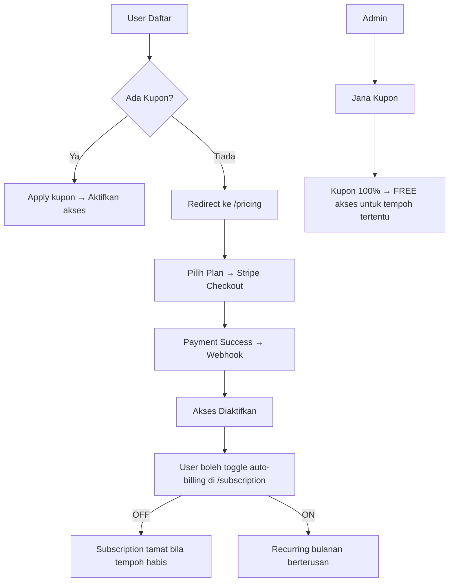

# 📋 Prompt Planning — Vocabulary

_Source of Truth utama sepanjang hayat projek. Disusun mengikut piawaian Fasa 1 Abu Hanifah._

---

## 1. Visi & Misi

**Visi**: Menjadi platform pembelajaran bahasa Inggeris (dan bahasa lain) terkemuka di Malaysia yang memfokuskan penghafalan **ayat penuh**, bukan sekadar perkataan.

**Misi**: Membantu pengguna menguasai bahasa sasaran melalui latihan harian menterjemah 20 ayat BM ke bahasa sasaran, menjadikan mereka fasih dan yakin bertutur.

**Proposisi Nilai (USP)**:
- Konsep "Hafal Ayat, Bukan Perkataan" — pendekatan unik berbanding aplikasi sedia ada.
- Kuiz interaktif harian dengan sistem semakan jawapan Rust berkelajuan tinggi.
- Sokongan variasi jawapan pasaran (`wanna`, `gonna`, `gotta`) supaya pengguna belajar bahasa sebenar.
- Sistem kupon & langganan fleksibel (percuma / berbayar).

---

## 2. Tech Stack

| Komponen | Teknologi | Catatan |
| :--- | :--- | :--- |
| **Frontend** | Next.js 15 (App Router), TypeScript, Tailwind CSS + shadcn/ui | Server Components + Client Components hibrid |
| **Backend** | Laravel 12 (PHP 8.3+) | Sanctum SPA Auth, Modular Controllers, Services |
| **Quiz Engine** | Rust (Axum) | Microservice pemeriksa jawapan berkelajuan tinggi (Docker container) |
| **Database** | PostgreSQL 16 | UUID v4 sebagai Primary Key, citext extension |
| **Cache & Queue** | Redis | Rate Limiting, Laravel Queue driver, session cache |
| **Pembayaran** | Stripe API (Recurring Subscription) | Webhook handler untuk checkout, invoice, subscription events |
| **Keselamatan** | Cloudflare Turnstile, Bcrypt Hashing, Laravel CSRF | Sanctum SPA cookies untuk auth |
| **Infrastruktur** | Docker Compose, Nginx (Reverse Proxy) | PostgreSQL, Redis, Quiz Engine, Mailpit (dev) |
| **CI/CD** | GitHub Actions → GHCR | Auto deploy dengan Docker Compose pull |

---

## 3. Peta Laman & Aliran Halaman (Sitemap)

### Lapisan A: Public Pages (Akses Awam)
| Laluan | Fungsi |
| :--- | :--- |
| `/` | Laman utama (hero, CTA daftar/masuk) |
| `/login` | Log masuk pengguna |
| `/register` | Pendaftaran akaun baharu |
| `/pricing` | Halaman harga & pelan langganan |
| `/promo` | Halaman promosi pemasaran (Stitch UI) |

### Lapisan B: User Pages (Pengguna Berdaftar)
| Laluan | Fungsi |
| :--- | :--- |
| `/dashboard` | Ringkasan progress, streak, level terkini |
| `/quiz/[lang]/[levelId]` | Kuiz hafalan 20 ayat untuk bahasa & level tertentu |
| `/results/[sessionId]` | Keputusan skor selepas selesai 20 soalan |
| `/review/[lang]/[levelId]` | Ulang kuiz untuk ayat yang belum dihafal |
| `/profile` | Profil & tetapan pengguna |
| `/subscription` | Urus langganan (toggle auto-billing, tukar pelan) |

### Lapisan C: Admin Pages (Portal Pentadbir — Role: Admin)
| Laluan | Fungsi |
| :--- | :--- |
| `/admin/dashboard` | Statistik admin (jumlah pengguna, hasil, langganan aktif) |
| `/admin/languages` | CRUD Bahasa |
| `/admin/levels` | CRUD Level (ikut bahasa) |
| `/admin/sentences` | CRUD Ayat (ikut level & bahasa) + sokongan format `[skema/pasaran]` |
| `/admin/plans` | Set harga langganan (boleh ubah) |
| `/admin/coupons` | Jana & urus kupon diskaun (100% = percuma) |
| `/admin/users` | Senarai pengguna & status langganan |
| `/admin/transactions` | Log pembayaran Stripe |

---

## 4. Skema Pangkalan Data (PostgreSQL)

Jadual-jadual utama berdasarkan migrasi Laravel sedia ada:

| Jadual | Fungsi | Index Utama |
| :--- | :--- | :--- |
| `users` | Pengguna sistem (User & Admin) | `email` (UNIQUE), `role` |
| `languages` | Bahasa yang disokong (EN, DE, JP) | `code` (UNIQUE) |
| `levels` | Tahap kesukaran per bahasa | `language_id`, `order` (UNIQUE per language) |
| `sentences` | Ayat soalan kuiz (BM → Target) | `level_id`, `order` |
| `subscription_plans` | Pelan langganan (harga, Stripe Price ID) | `slug` (UNIQUE) |
| `subscriptions` | Langganan aktif pengguna | `user_id`, `stripe_subscription_id` |
| `coupons` | Kupon diskaun (0-100%) | `code` (UNIQUE) |
| `coupon_redemptions` | Log penebusan kupon oleh pengguna | `user_id`, `coupon_id` |
| `quiz_sessions` | Sesi kuiz pengguna (20 soalan) | `user_id`, `level_id`, `status` |
| `quiz_answers` | Jawapan individu dalam sesi kuiz | `session_id`, `sentence_id` |
| `transactions` | Log transaksi pembayaran Stripe | `user_id`, `status` |

---

## 5. Carta Alir Teras (Core Loop — Mermaid)

### 5.1 Aliran Kuiz

```mermaid
flowchart TD
    A[Mula Quiz Level N] --> B[Paparkan Ayat BM]
    B --> C{User taip jawapan}
    C -->|"Betul ✓"| D[Tandakan correct]
    C -->|"Salah / Tak Tahu"| E[Tekan "Bagi Jawapan"]
    E --> F[Paparkan jawapan betul & bandingkan]
    F --> G[Tandakan revealed + incorrect]
    D --> H{Semua 20 soalan?}
    G --> H
    H -->|Belum| B
    H -->|Ya| I[Paparkan Result - Skor /20]
    I --> J{Pilih tindakan}
    J -->|"Belum Hafal"| K[Ulang quiz level sama]
    J -->|"Dah Hafal"| L[Unlock Level N+1]
    K --> A
    L --> M[Redirect Dashboard]
```

### 5.2 Aliran Langganan & Kupon



---

## 6. Integrasi API & Pihak Ketiga

| Servis | Kegunaan | Endpoint Backend |
| :--- | :--- | :--- |
| **Stripe** | Pembayaran langganan automatik (Checkout + Webhook) | `POST /stripe/webhook` |
| **Cloudflare Turnstile** | Pengesahan bot pada borang Login, Register, Promo | `verify_turnstile()` middleware |
| **Quiz Engine (Rust)** | Pemeriksa jawapan berkelajuan tinggi + variasi `[skema/pasaran]` | `POST :8080/check-answer` |
| **SMTP (Mailpit dev)** | Penghantaran e-mel (pengesahan, notifikasi) | Laravel Queue |

---

## 7. Protokol Keselamatan (32 Global Rules)

Projek ini mematuhi kesemua 32 Peraturan Keselamatan Global (`RULE[user_global]`). Ringkasan pelaksanaan utama:

- [x] **Input Validation**: Server-side validation pada semua endpoint Laravel.
- [x] **Sanitization**: HTML escaping untuk semua data rendered di UI.
- [x] **Prepared Statements**: Eloquent ORM parameterized queries sahaja.
- [x] **OLAC**: Setiap query `WHERE id = ? AND user_id = ?`.
- [x] **UUID v4**: Semua resource menggunakan UUID, bukan integer ID.
- [x] **Bcrypt Hashing**: Kata laluan di-hash menggunakan Bcrypt.
- [x] **Sanctum SPA Auth**: Cookie-based auth (SameSite=Lax, HttpOnly).
- [x] **CSRF Protection**: Laravel CSRF token pada setiap POST/PUT/DELETE.
- [x] **Rate Limiting**: Global + ketat pada auth endpoints.
- [x] **Cloudflare Turnstile**: Login, Register, Promo forms.
- [x] **Atomic Transactions**: DB::transaction untuk operasi multi-jadual.
- [x] **Modular Code**: Fail < 250 baris, SRP, Service classes.
- [x] **Security Event Logging**: Log aktiviti penting ke database.
- [x] **Environment Variable Protection**: Tiada hardcoded secrets.

---

## 8. Struktur Folder Projek (Modular)

```
vocabulary/
├── backend/                         # Laravel 12 Backend
│   ├── app/
│   │   ├── Models/                  # Eloquent Models (User, Language, Level, etc.)
│   │   ├── Http/
│   │   │   ├── Controllers/
│   │   │   │   ├── Api/             # Public & User endpoints
│   │   │   │   │   ├── AuthController.php
│   │   │   │   │   ├── QuizController.php
│   │   │   │   │   ├── LanguageController.php
│   │   │   │   │   ├── SubscriptionController.php
│   │   │   │   │   ├── CouponController.php
│   │   │   │   │   └── ProfileController.php
│   │   │   │   └── Admin/           # Admin-specific handlers
│   │   │   │       ├── DashboardController.php
│   │   │   │       ├── LanguageController.php
│   │   │   │       ├── LevelController.php
│   │   │   │       ├── SentenceController.php
│   │   │   │       ├── PlanController.php
│   │   │   │       ├── CouponController.php
│   │   │   │       ├── UserController.php
│   │   │   │       └── TransactionController.php
│   │   │   └── Middleware/          # AdminMiddleware, SubscribedMiddleware
│   │   ├── Services/                # StripeService, QuizService, CouponService
│   │   └── Enums/                   # UserRole, QuizSessionStatus
│   ├── database/migrations/         # Laravel migration files
│   └── routes/                      # api.php, web.php
├── frontend/                        # Next.js 15 Frontend
│   └── src/
│       ├── app/
│       │   ├── page.tsx             # Landing page
│       │   ├── login/               # Log masuk
│       │   ├── register/            # Pendaftaran
│       │   ├── pricing/             # Halaman harga
│       │   ├── promo/               # Halaman promosi (Stitch UI)
│       │   ├── dashboard/           # Dashboard pengguna
│       │   ├── quiz/[lang]/[levelId]/ # Kuiz hafalan
│       │   ├── review/[lang]/[levelId]/ # Ulang kuiz
│       │   ├── profile/             # Profil pengguna
│       │   ├── subscription/        # Urus langganan
│       │   └── admin/               # Portal pentadbir
│       │       ├── dashboard/
│       │       ├── languages/
│       │       ├── levels/
│       │       ├── sentences/
│       │       ├── plans/
│       │       ├── coupons/
│       │       ├── users/
│       │       └── transactions/
│       ├── components/ui/           # shadcn/ui components
│       └── lib/                     # api.ts, auth.ts, utils.ts
├── quiz-engine/                     # Rust Axum Microservice
│   └── src/main.rs                  # check-answer endpoint + [skema/pasaran] parser
├── nginx/                           # Nginx reverse proxy config
├── scripts/                         # Utility scripts
├── docker-compose.yml               # Development environment
├── docker-compose.prod.yml          # Production deployment
├── .github/                         # CI/CD workflows
├── roadmap.md                       # Status ciri-ciri & ujian
├── features.md                      # Daftar induk fitur & unit test
├── security_audit.md                # Rekod kelulusan ujian setiap modul
└── prompt_planning.md               # ← FAIL INI (Source of Truth)
```

---

## 9. Bahasa Komunikasi

| Konteks | Bahasa |
| :--- | :--- |
| Komunikasi dengan pengguna (Abu Hanifah) | Bahasa Malaysia (BM) |
| Penulisan kod & logik teknikal | English (EN) |
| Implementation Plan & Roadmap | Bahasa Malaysia (BM) |
| UI Aplikasi | English (EN) utama |

---

## 10. UI/UX Guidelines

- **Design System**: Light mode utama, kuning/amber sebagai warna aksen utama.
- **Warna Utama**: Amber (`#f59e0b`), Orange (`#f97316`), Hijau success (`#22c55e`).
- **Typography**: Font system modern (Inter via Tailwind defaults).
- **Komponen**: shadcn/ui components, rounded corners, subtle borders.
- **Animasi**: Hover effects, transition-colors, confetti effect pada unlock level.
- **Responsif**: Mobile-first dengan grid breakpoints (`md:`, `lg:`).
- **Ikon**: Lucide React icon library.
- **Quiz UI**: Ayat besar di tengah, input bawah, progress bar atas, butang "Bagi Jawapan" warna amber/warning.
- **Ciri Khas**: Sokongan variasi jawapan `[want to/wanna]` dipaparkan sebagai `want to (wanna)` kepada pengguna.

---

## 11. Roadmap MVP

Projek ini telah melepasi Fasa MVP dan kini dalam mod penyelenggaraan aktif. Status terkini:

| Kategori | Status |
| :--- | :--- |
| Infrastruktur (Docker, Nginx, Redis, Quiz Engine) | ✅ Siap |
| Pangkalan Data (Migrations, Indexing, Transactions) | ✅ Siap |
| Modul Keselamatan (Auth, Turnstile, Rate Limit) | ✅ Siap |
| Admin CRUD (Languages, Levels, Sentences, Plans, Coupons) | ✅ Siap |
| Kuiz Core Loop (20 ayat, answer + reveal + practice) | ✅ Siap |
| Variasi Jawapan `[skema/pasaran]` (Quiz Engine + Frontend) | ✅ Siap |
| Stripe Checkout + Webhook | ✅ Siap |
| Sistem Kupon (100% free access) | ✅ Siap |
| Pengurusan Langganan (toggle auto-billing) | ✅ Siap |
| Dashboard Pengguna (progress, streak) | ✅ Siap |
| Halaman Promosi (Stitch UI, responsive) | ✅ Siap |
| CI/CD Pipeline (GitHub Actions → GHCR) | ✅ Siap |

---

_Dikemas kini terakhir: 17 Jun 2026_
_Diurus oleh: Abu Hanifah (AI Jurutera Kanan)_
