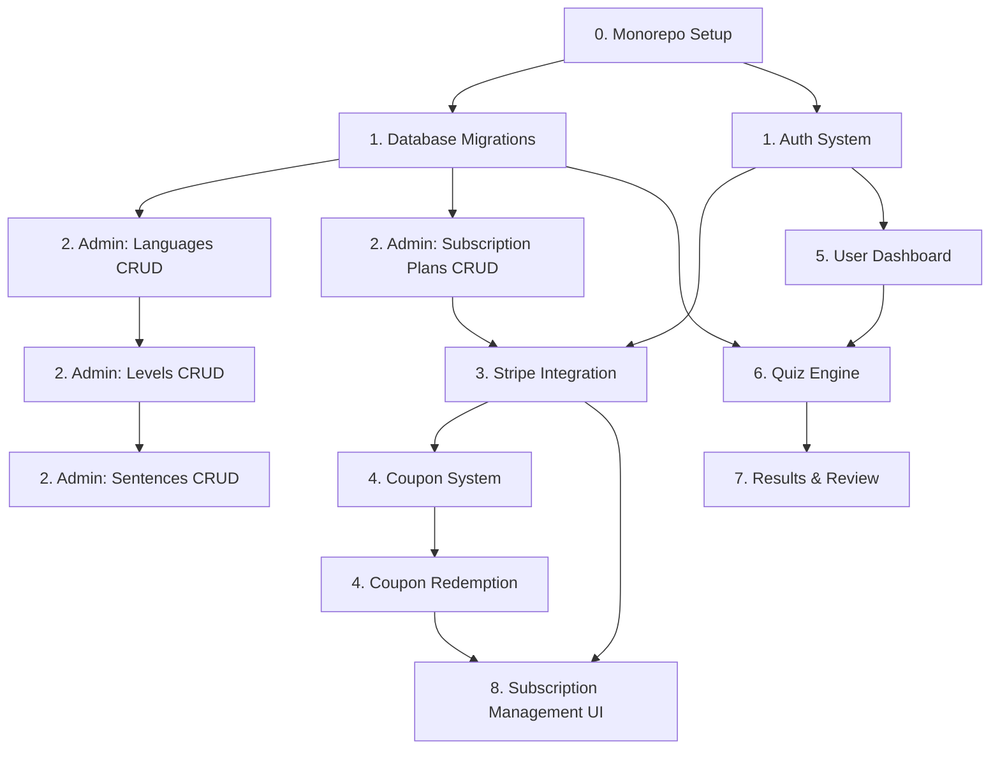

# 🗺️ Vocabulary — Roadmap Pelaksanaan

> **Fasa 1: Project Mapping**
> Fail ini menjawab: apa yang perlu dibina, dalam urutan apa, dan apa dependency antara modul.

---

## 📊 Dependency Map



---

## 📋 Pecahan Sub-Fasa Implementation

### Sub-Fasa 0: Monorepo Setup

| #   | Task                                     | Status | Dependency |
| --- | ---------------------------------------- | ------ | ---------- |
| 0.1 | Create Laravel 12 project in `laravel/`  | ✅     | -          |
| 0.2 | Configure PostgreSQL connection          | ✅     | 0.1        |
| 0.3 | Install Sanctum + configure SPA auth     | ✅     | 0.1        |
| 0.4 | Create Next.js 15 project in `frontend/` | ✅     | -          |
| 0.5 | Install shadcn/ui + Tailwind CSS         | ✅     | 0.4        |
| 0.6 | Setup Axios instance + API base config   | ✅     | 0.4        |
| 0.7 | Create `.env.example` for both projects  | ✅     | 0.1, 0.4   |

### Sub-Fasa 1: Database & Auth Foundation

| #    | Task                                                   | Status | Dependency     |
| ---- | ------------------------------------------------------ | ------ | -------------- |
| 1.1  | Migration: `languages`                                 | ✅     | 0.2            |
| 1.2  | Migration: `users` (with UUID, role)                   | ✅     | 0.2            |
| 1.3  | Migration: `levels`                                    | ✅     | 1.1            |
| 1.4  | Migration: `sentences`                                 | ✅     | 1.3            |
| 1.5  | Migration: `subscription_plans`                        | ✅     | 0.2            |
| 1.6  | Migration: `subscriptions`                             | ✅     | 1.2, 1.5       |
| 1.7  | Migration: `coupons`                                   | ✅     | 0.2            |
| 1.8  | Migration: `coupon_redemptions`                        | ✅     | 1.2, 1.7       |
| 1.9  | Migration: `quiz_sessions`                             | ✅     | 1.2, 1.1, 1.3  |
| 1.10 | Migration: `quiz_answers`                              | ✅     | 1.9, 1.4       |
| 1.11 | Migration: `transactions`                              | ✅     | 1.2, 1.6       |
| 1.12 | All Eloquent Models + Relationships                    | ✅     | All migrations |
| 1.13 | Enums: UserRole, QuizSessionStatus, SubscriptionStatus | ✅     | -              |
| 1.14 | Register API + Form Request validation                 | ✅     | 1.2            |
| 1.15 | Login API + token issuance                             | ✅     | 1.2            |
| 1.16 | Logout API                                             | ✅     | 1.15           |
| 1.17 | AdminMiddleware                                        | ✅     | 1.12           |
| 1.18 | SubscribedMiddleware                                   | ✅     | 1.12           |
| 1.19 | Seed: default admin user                               | ✅     | 1.2            |
| 1.20 | Seed: language English + sample sentences              | ✅     | 1.4            |

### Sub-Fasa 2: Admin Panel (Backend API)

| #   | Task                                           | Status | Dependency |
| --- | ---------------------------------------------- | ------ | ---------- |
| 2.1 | Admin: CRUD Languages API                      | ✅     | 1.17       |
| 2.2 | Admin: CRUD Levels API (nested under language) | ✅     | 2.1        |
| 2.3 | Admin: CRUD Sentences API (nested under level) | ✅     | 2.2        |
| 2.4 | Admin: CRUD Subscription Plans API             | ✅     | 1.5, 1.17  |
| 2.5 | Admin: CRUD Coupons + Generate API             | ✅     | 1.7, 1.17  |
| 2.6 | Admin: List Users + Update Role API            | ✅     | 1.17       |
| 2.7 | Admin: List Transactions API                   | ✅     | 1.11, 1.17 |
| 2.8 | Admin: Dashboard Stats API                     | ✅     | 1.12       |

### Sub-Fasa 3: Stripe Integration

| #    | Task                                                        | Status | Dependency     |
| ---- | ----------------------------------------------------------- | ------ | -------------- |
| 3.1  | Install Stripe PHP SDK + config                             | ✅     | 0.1            |
| 3.2  | StripeService (create customer, checkout, webhook)          | ✅     | 3.1            |
| 3.3  | Create Checkout Session API                                 | ✅     | 3.2, 1.5, 1.15 |
| 3.4  | Stripe Webhook Handler (`/stripe/webhook`)                  | ✅     | 3.2            |
| 3.5  | Handle `checkout.session.completed` → activate subscription | ✅     | 3.4            |
| 3.6  | Handle `invoice.paid` → log transaction                     | ✅     | 3.4            |
| 3.7  | Handle `customer.subscription.updated` → sync status        | ✅     | 3.4            |
| 3.8  | Handle `customer.subscription.deleted` → deactivate         | ✅     | 3.4            |
| 3.9  | Toggle Auto-Renew API                                       | ✅     | 3.2, 1.6       |
| 3.10 | Get Subscription Status API                                 | ✅     | 1.6            |

### Sub-Fasa 4: Coupon System

| #   | Task                                           | Status | Dependency |
| --- | ---------------------------------------------- | ------ | ---------- |
| 4.1 | CouponService (validate, redeem, check expiry) | ✅     | 1.7, 1.8   |
| 4.2 | Validate Coupon API (public)                   | ✅     | 4.1        |
| 4.3 | Redeem Coupon API (authenticated)              | ✅     | 4.1, 1.15  |
| 4.4 | My Coupons API (list redeemed coupons)         | ✅     | 1.8        |

### Sub-Fasa 5: User Dashboard

| #   | Task                                                           | Status | Dependency |
| --- | -------------------------------------------------------------- | ------ | ---------- |
| 5.1 | Dashboard API (progress per language, streak, unlocked levels) | ✅     | 1.9, 1.10  |
| 5.2 | Profile API (get/update)                                       | ✅     | 1.15       |
| 5.3 | Public Languages List API                                      | ✅     | 1.1        |
| 5.4 | Levels List API (by language, filtered by access)              | ✅     | 1.3        |

### Sub-Fasa 6: Quiz Engine (Core)

| #   | Task                                                         | Status | Dependency |
| --- | ------------------------------------------------------------ | ------ | ---------- |
| 6.1 | QuizService (start session, get sentences, check answer)     | ✅     | 1.9, 1.10  |
| 6.2 | Start Quiz API → create session, return first question       | ✅     | 6.1, 1.18  |
| 6.3 | Submit Answer API → check + store                            | ✅     | 6.1        |
| 6.4 | Reveal Answer API → show correct answer                      | ✅     | 6.1        |
| 6.5 | Get Next Question API                                        | ✅     | 6.1        |
| 6.6 | Complete Session API → calculate score, unlock next level    | ✅     | 6.1        |
| 6.7 | Get Session Details API                                      | ✅     | 1.9        |
| 6.8 | Answer comparison logic (citext, trim, punctuation-tolerant) | ✅     | 6.1        |

### Sub-Fasa 7: Results, Review & Progress

| #   | Task                                                         | Status | Dependency |
| --- | ------------------------------------------------------------ | ------ | ---------- |
| 7.1 | Get Session Result API (score, per-question breakdown)       | ✅     | 1.10       |
| 7.2 | Get Unmemorized Sentences API (for "Belum Hafal" review)     | ✅     | 1.10       |
| 7.3 | Repeat Quiz Logic (create new session from failed sentences) | ✅     | 6.1        |

### Sub-Fasa 8: Frontend — Foundation

| #   | Task                                   | Status | Dependency |
| --- | -------------------------------------- | ------ | ---------- |
| 8.1 | Layout: RootLayout (dark theme, fonts) | ✅     | 0.5        |
| 8.2 | Layout: Navbar (auth-aware)            | ✅     | 8.1        |
| 8.3 | Layout: Footer                         | ✅     | 8.1        |
| 8.4 | Landing Page (hero, CTA, features)     | ✅     | 8.1        |
| 8.5 | Login Page                             | ✅     | 1.15, 0.6  |
| 8.6 | Register Page                          | ✅     | 1.14, 0.6  |
| 8.7 | Pricing Page (display plans from API)  | ✅     | 5.3        |
| 8.8 | AuthContext + useAuth hook             | ✅     | 0.6        |

### Sub-Fasa 9: Frontend — Authenticated Pages

| #   | Task                                                      | Status | Dependency |
| --- | --------------------------------------------------------- | ------ | ---------- |
| 9.1 | Dashboard Page (progress, streak, languages, levels)      | ✅     | 5.1, 5.4   |
| 9.2 | Profile Page (edit name, email, password)                 | ✅     | 5.2        |
| 9.3 | Subscription Page (status, toggle auto-bill, change plan) | ✅     | 3.9, 3.10  |
| 9.4 | Coupon Redemption UI (modal on dashboard)                 | ✅     | 4.3        |

### Sub-Fasa 10: Frontend — Quiz Experience

| #     | Task                                                 | Status | Dependency         |
| ----- | ---------------------------------------------------- | ------ | ------------------ |
| 10.1  | QuizCard component (sentence display)                | ✅     | 0.5                |
| 10.2  | AnswerInput component (text input + submit)          | ✅     | 0.5                |
| 10.3  | RevealAnswer component (show correct answer)         | ✅     | 0.5                |
| 10.4  | QuizProgress component (progress bar + x/20 counter) | ✅     | 0.5                |
| 10.5  | Quiz Page (full quiz flow, state machine)            | ✅     | 10.1-10.4, 6.2-6.7 |
| 10.6  | useQuiz hook (state management)                      | ✅     | 6.2-6.7            |
| 10.7  | Results Page (score display, per-question review)    | ✅     | 7.1                |
| 10.8  | "Belum Hafal" → redirect to review page              | ✅     | 7.2, 7.3           |
| 10.9  | "Dah Hafal" → confirmation + confetti + redirect     | ✅     | 6.6                |
| 10.10 | Review Page (repeat unmemorized sentences)           | ✅     | 7.2, 7.3           |

### Sub-Fasa 11: Frontend — Admin Panel

| #     | Task                                                    | Status | Dependency |
| ----- | ------------------------------------------------------- | ------ | ---------- |
| 11.1  | AdminLayout (sidebar navigation)                        | ✅     | 8.1        |
| 11.2  | Admin Dashboard Page (stats cards, charts)              | ✅     | 2.8        |
| 11.3  | Admin: Languages CRUD UI                                | ✅     | 2.1        |
| 11.4  | Admin: Levels CRUD UI (filtered by language)            | ✅     | 2.2        |
| 11.5  | Admin: Sentences CRUD UI (filtered by level + language) | ✅     | 2.3        |
| 11.6  | Admin: Plans CRUD UI                                    | ✅     | 2.4        |
| 11.7  | Admin: Coupons CRUD + Generate UI                       | ✅     | 2.5        |
| 11.8  | Admin: Users List UI                                    | ✅     | 2.6        |
| 11.9  | Admin: Transactions List UI                             | ✅     | 2.7        |
| 11.10 | DataTable reusable component                            | ✅     | 0.5        |

### Sub-Fasa 12: Polish & Testing

| #    | Task                                                  | Status | Dependency |
| ---- | ----------------------------------------------------- | ------ | ---------- |
| 12.1 | Unit Tests: Auth                                      | ✅     | 1.14-1.16  |
| 12.2 | Unit Tests: Quiz Engine                               | ✅     | 6.1-6.8    |
| 12.3 | Unit Tests: Coupon System                             | ✅     | 4.1-4.4    |
| 12.4 | Unit Tests: Stripe Webhooks                           | ✅     | 3.4-3.8    |
| 12.5 | Feature Tests: Admin CRUD                             | ✅     | 2.1-2.8    |
| 12.6 | Responsive QA (mobile + desktop)                      | ✅     | 9.x, 10.x  |
| 12.7 | Security audit (CSRF, XSS, SQL injection, OLAC)       | ✅     | All        |
| 12.8 | Performance optimization (Redis cache, eager loading) | ✅     | All        |

### Sub-Fasa 13: Auto-Detection & Mockup Integration

| # | Task | Status | Dependency |
|---|------|--------|------------|
| 13.1 | Wire-up mockup: `frontend/src/app/admin/layout.tsx` | ✅ | - |
| 13.2 | Wire-up mockup: `frontend/src/app/admin/coupons/page.tsx` | ✅ | - |
| 13.3 | Wire up API for `frontend/src/app/page.tsx` | ✅ | - |
| 13.4 | Wire up API for `frontend/src/app/quiz/page.tsx` | ✅ | - |
| 13.5 | Wire up API for `frontend/src/components/admin/DataTable.tsx` | ✅ | - |
| 13.6 | Wire up API for `frontend/src/app/quiz/[lang]/[levelId]/page.tsx` | ✅ | - |
| 13.7 | Wire up API for `frontend/src/app/pricing/page.tsx` | ✅ | - |
| 13.8 | Wire up API for `frontend/src/app/admin/plans/page.tsx` | ✅ | - |
| 13.9 | Wire up API for `frontend/src/app/admin/transactions/page.tsx` | ✅ | - |
| 13.10 | Wire up API for `frontend/src/app/admin/users/page.tsx` | ✅ | - |
| 13.11 | Wire up API for `frontend/src/app/results/[sessionId]/page.tsx` | ✅ | - |
| 13.12 | Wire up API for `frontend/src/app/review/[lang]/[levelId]/page.tsx` | ✅ | - |

| 13.13 | Wire up API for `frontend/src/app/subscription/page.tsx` | ✅ | - |
| 13.14 | Wire up API for `frontend/src/app/admin/dashboard/page.tsx` | ✅ | - |
| 13.15 | Wire up API for `frontend/src/app/profile/page.tsx` | ✅ | - |
## 📊 Progress Keseluruhan

| Fasa           | Sub-Fasa                       | Status        |
| -------------- | ------------------------------ | ------------- |
| **Fasa 1 & 2** | Project Mapping + Mockup       | ✅ 38/38      |
| **Fasa 3**     | Sub-Fasa 0: Monorepo Setup     | ✅ 7/7        |
| **Fasa 3**     | Sub-Fasa 1: Database & Auth    | ✅ 20/20      |
| **Fasa 3**     | Sub-Fasa 2: Admin Panel API    | ✅ 8/8        |
| **Fasa 3**     | Sub-Fasa 3: Stripe Integration | ✅ 10/10      |
| **Fasa 3**     | Sub-Fasa 4: Coupon System      | ✅ 4/4        |
| **Fasa 3**     | Sub-Fasa 5: Dashboard API      | ✅ 4/4        |
| **Fasa 3**     | Sub-Fasa 6: Quiz Engine        | ✅ 8/8        |
| **Fasa 3**     | Sub-Fasa 7: Results & Review   | ✅ 3/3        |
| **Fasa 3**     | Sub-Fasa 8: Frontend - Found.  | ✅ 8/8        |
| **Fasa 3**     | Sub-Fasa 9: Frontend - Auth    | ✅ 4/4        |
| **Fasa 3**     | Sub-Fasa 10: Frontend - Quiz   | ✅ 10/10      |
| **Fasa 3**     | Sub-Fasa 11: Frontend - Admin  | ✅ 10/10      |
| **Fasa 3**     | Sub-Fasa 12: Polish            | ✅ 8/8        |
| **Fasa 3**     | Sub-Fasa 13: Mockups           | ✅ 15/15      |
| **Fasa 4**     | Imbasan Keselamatan (Security) | ✅ Lengkap    |
| **Fasa 5**     | Konfigurasi Produksi & Nginx   | ✅ Lengkap    |
| **Fasa 6**     | Ujian Bebanan - Load Testing   | ✅ Lengkap    |
|                | **Total**                      | **💪 160/160** |

---

## 🔗 Urutan Pelaksanaan (Critical Path)

```
0. Monorepo Setup
    ↓
1. Database & Auth Foundation ← WAJIB siap dulu
    ↓
    ├── 2. Admin Panel API ──→ 11. Admin Panel UI
    ├── 3. Stripe Integration
    │       ↓
    ├── 4. Coupon System
    ├── 5. User Dashboard API
    │       ↓
    ├── 6. Quiz Engine (Core)
    │       ↓
    └── 7. Results & Review
            ↓
        8. Frontend Foundation
            ↓
        9. Authenticated Pages
            ↓
        10. Quiz Experience UI
            ↓
        12. Polish & Testing
            ↓
        Fasa 4. Imbasan Keselamatan
            ↓
        Fasa 5. Konfigurasi Produksi & Nginx
            ↓
        Fasa 6. Ujian Bebanan - Load Testing
```

---

> **Status Legend**: ⬜ Not Started | 🔄 In Progress | ✅ Done

---

> **EOF**
> Roadmap ini adalah panduan pelaksanaan Fasa 3+ Abu Hanifah.
> Setiap task yang siap WAJIB dikemaskini statusnya di sini.

---

## ✅ Log Perubahan

| Tarikh     | Perubahan                                                                       |
| ---------- | ------------------------------------------------------------------------------- |
| 2026-05-24 | Fasa 1 & 2 selesai — 38 tasks ✅ — 18 routes mockup ✅                          |
| 2026-05-24 | Monorepo: Laravel 12 + Next.js 16 + shadcn/ui setup ✅                          |
| 2026-05-24 | Dark/Light theme, mobile bottom nav, hero card dashboard ✅                     |
| 2026-05-24 | Admin pages: levels + sentences mockup ✅                                       |
| 2026-05-24 | Roadmap final — 104 tasks, 38 mockup ✅ with 104 tasks across 12 sub-fasas      |
| 2026-05-24 | ✅ Marked all completed tasks: Sub-Fasa 0-7 (all ✅), 8-11 (~31/38 ✅), 12 (⬜) |
| 2026-05-25 | ✅ Fasa 3 Lengkap Sepenuhnya! Unit testing lulus 100%, mockups bersepadu dengan API, sistem pengesanan Mockup 100% bersih! |
| 2026-05-28 | ✅ Fasa 4 (Imbasan Keselamatan) & Fasa 5 (Konfigurasi Produksi & Nginx) selesai! |
| 2026-05-28 | ✅ Fasa 6 (Ujian Bebanan - Load Testing) selesai! Skrip k6 load test dijana.       |
